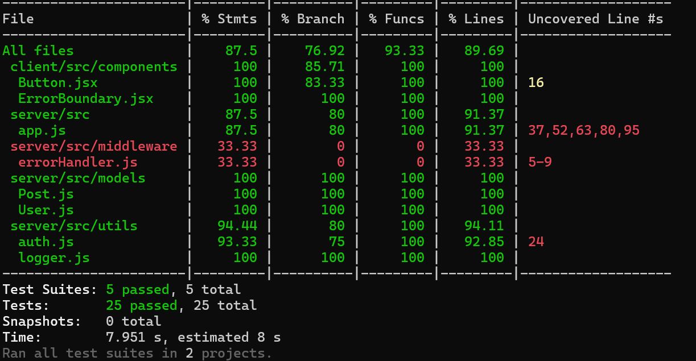
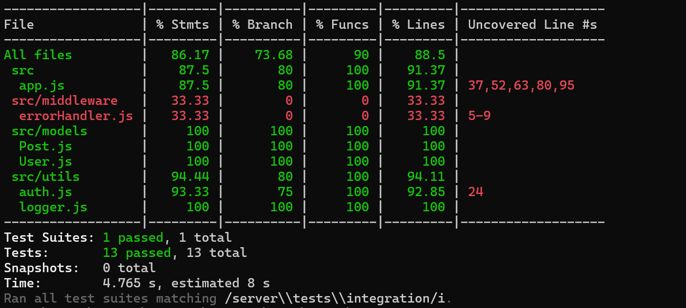
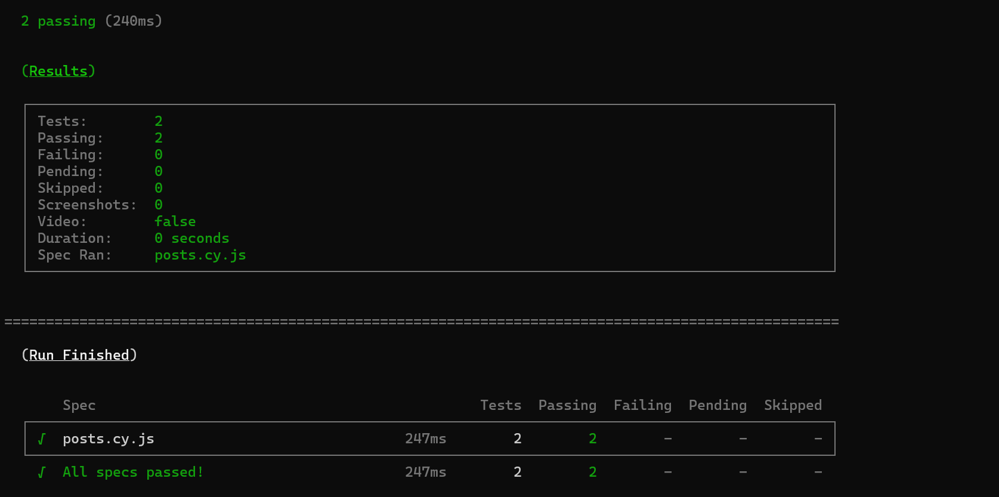
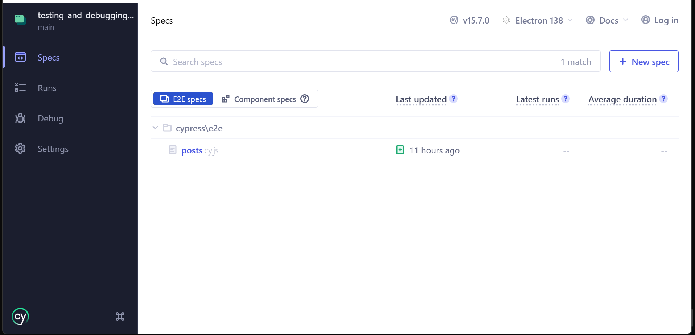

# Testing and Debugging MERN Applications

This repository contains a minimal MERN (MongoDB, Express, React, Node) starter app focused on testing and debugging.

## Code explanation (overview)

The project separates client and server code and includes tests for each layer. High-level structure:

```
mern-testing-root/
├── client/                 # React front-end and client tests
│   └── src/                # React source (components, tests)
├── server/                 # Express back-end and server tests
│   └── src/                # Server source (models, routes, middleware)
├── cypress/                # End-to-end tests (Cypress)
├── jest.config.js          # Root Jest configuration
└── package.json            # Root scripts and dev dependencies
```

Key components:

- `client/src/components/`: example components (e.g., `Button`, `ErrorBoundary`) with unit tests.
- `client/src/tests/`: Jest + React Testing Library setup for client tests.
- `server/src/models/`: Mongoose models (`User`, `Post`) used by integration tests.
- `server/src/app.js`: Express app exposing `/api/posts` CRUD endpoints and using middleware.
- `server/src/middleware/errorHandler.js`: global error handler that normalizes Mongoose errors.
- `server/src/utils/logger.js`: Winston logger used for structured logs.
- `server/tests/`: unit and integration tests (Supertest + mongodb-memory-server).

These files show how to write unit, integration, and minimal E2E tests for a MERN app.

## Files included

- `Week6-Assignment.md` — assignment instructions
- `TESTING.md` — testing strategy and commands
- `coverage/` — generated coverage reports after running tests
- `cypress/` — Cypress config and minimal E2E specs

---

## Instructions (how to run)

Follow these steps to install dependencies and run tests. Run commands from the repository root.

1) Install dependencies for both client and server:

```powershell
npm run install-all
```

2) Run all tests (Jest) with coverage:

```powershell
npm test
# coverage artifacts will be in the `coverage/` folder
```

3) Run tests by category:

```powershell
# Unit tests only
npm run test:unit

# Integration tests only
npm run test:integration

# End-to-end tests (Cypress headless) — requires the server to be running
npm run test:e2e

# Open Cypress interactive runner
npm run cypress:open
```

4) Start the server (for E2E or manual testing):

```powershell
npm --prefix server run start
```

5) Optional: override DB or port.

```powershell
$env:MONGO_URI = 'mongodb://127.0.0.1:27017/mern-testing-e2e'
$env:PORT = '5000'
npm --prefix server run start
```

## Requirements

- Node.js (v18+)
- MongoDB (local or Atlas) or use Docker
- npm or yarn

## Testing tools

- Jest, React Testing Library, Supertest, Cypress, mongodb-memory-server

## Screenshots

# Run all tests with coverage report


# Run only unit tests


# Run only integration tests


# Run end-to-end tests


# Open Cypress interactive UI 


## Submission checklist

1. Unit tests for utilities and React components
2. Integration tests for API endpoints
3. Minimal E2E smoke spec (Cypress)
4. `TESTING.md` documenting commands and strategy
5. Coverage report in `coverage/` (target ≥70%)

## Resources

- Jest: https://jestjs.io/docs/getting-started
- React Testing Library: https://testing-library.com/docs/react-testing-library/intro/
- Supertest: https://github.com/visionmedia/supertest
- Cypress: https://docs.cypress.io/
- MongoDB testing: https://www.mongodb.com/blog/post/mongodb-testing-best-practices
