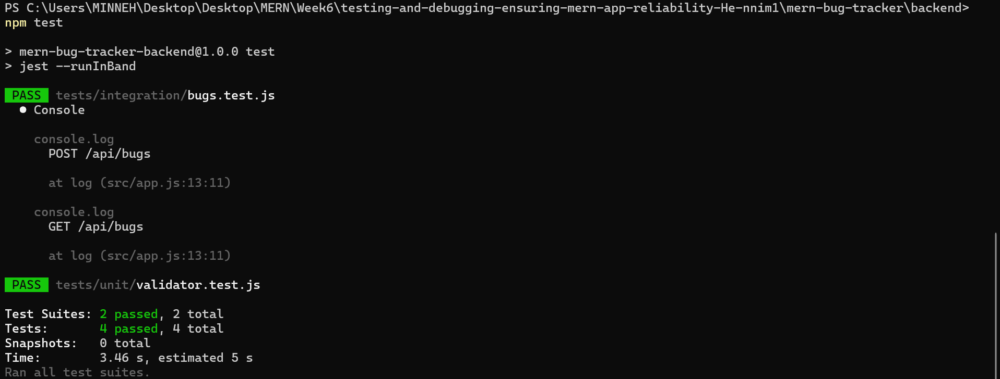
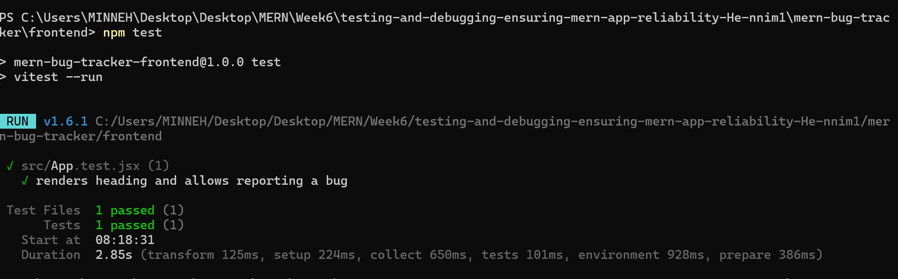

# MERN Bug Tracker (scaffold)

This folder contains a small MERN bug tracker scaffold used for testing and debugging exercises.

Structure:
- `backend/` - Express + Mongoose API for `/api/bugs`
- `frontend/` - Vite + React frontend with basic components and tests

Quick start (backend):

1. cd `backend`
2. npm install
3. npm run dev

Quick start (frontend):

1. cd `frontend`
2. npm install
3. npm start

Running tests:
- Backend: `npm test` in `backend`
- Frontend: `npm test` in `frontend` (uses `vitest`)

## Screenshots

# Backend 


# Frontend



## MERN Bug Tracker (scaffold)

This is a minimal MERN (MongoDB, Express, React, Node) scaffold for a "Bug Tracker" app used to demonstrate testing and debugging best practices.

Folders:
- `backend/` — Express API, Mongoose models, tests
- `frontend/` — React UI, component tests

Quick start (from `mern-bug-tracker`):

1. Install backend dependencies:

```powershell
cd backend
npm install
```

2. Install frontend dependencies:

```powershell
cd ../frontend
npm install
```

3. Start backend (default port 5000):

```powershell
cd ../backend
npm start
```

4. Start frontend (dev server):

```powershell
cd ../frontend
npm start
```

5. Run tests:

Backend unit & integration:
```powershell
cd backend
npm test
```

Frontend unit tests:
```powershell
cd frontend
npm test
```

This scaffold includes example tests and an error handler. Expand and adapt for the full assignment.
